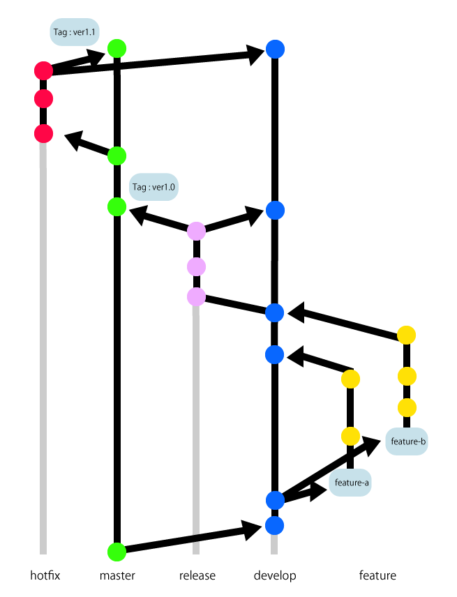

class: center, middle

#  Lv. 中級(Intermediate)

---

# Agenda
1. コミットについて
2. コミットサイズ
3. コミットメッセージ
4. issueとは
5. branchとは
6. Git-flowの活用

---
# 1. コミットについて

---
# 2. コミットサイズ

---
# 3. コミットメッセージ

---
# 4. issueとは

---
# 5. branchとは

---
# 6. Git-flowの活用
## a
[]

